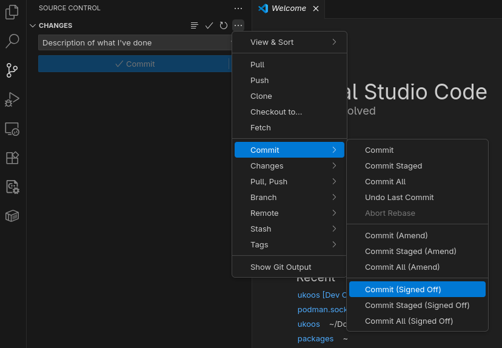

# Linux Setup Guide

Install [Visual Studio Code](https://code.visualstudio.com/docs/setup/linux) if you do not have it already.
Note that you will need to follow the instructions for your Linux distribution

Install these packages:

- git
- podman-docker

If you are using Debian/Ubuntu:

`sudo apt install git podman-docker`

If you are using Fedora:

`sudo dnf install git podman-docker`

If you are using Arch:

`sudo pacman -S git podman-docker`

If you are using a distribution not listed here, install with your distribution's package manager.

Open Visual Studio Code, and navigate to the Extensions menu located at the bottom of the left hand side bar.
Install the [Dev Containers](https://marketplace.visualstudio.com/items?itemName=ms-vscode-remote.remote-containers) extension.

git clone ukoOS (`git clone https://github.com/UMN-Kernel-Object/ukoos`), open the folder in Visual Studio Code (File -> Open Folder).
It should prompt you to `reopen in Dev Container.` If not, press `Ctrl` + `Shift` + `P` and type `Reopen in Dev Container`.

You are now in the ukoOS Dev Container.
To verify this, run the below command and verify the line `NAME="Alpine Linux"` is present.
`cat /etc/os-release`

When you have a change ready to be committed, you must sign off your commits.

**How to sign off and commit changes (in VSCode):**

Go to the "Source Control" tab in VSCode, and in the message box, write a description of what you've done.
Press the 3 dots icon shown below, go down to the `commit` menu, and select "Commit (Signed Off)."

When the pop-up "Would you like to stage all your changes and commit them directly" pops up, click yes.
To push the changes, click "Sync Changes."

**How to sign off and commit changes (in the CLI):**

Your commits should look something like this:
`git commit -s -m 'description of what you've done'`
