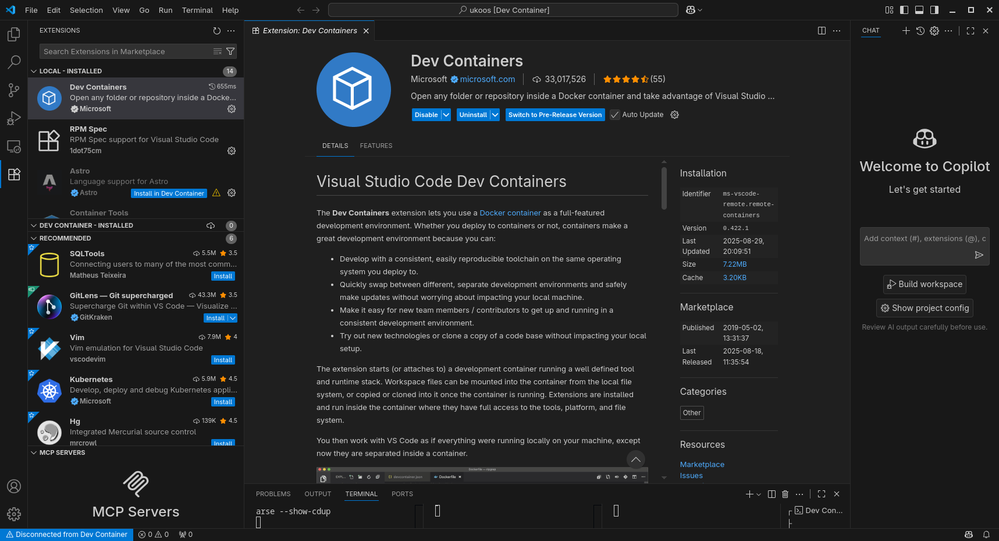

# Linux Setup Guide

Install [Visual Studio Code](https://code.visualstudio.com/docs/setup/linux) if you do not have it already. Note that you will need to follow the instructions for your Linux distribution

Install these packages:

- git
- podman-docker

If you are using Debian/Ubuntu

`sudo apt install git podman-docker`

If you are using Fedora

`sudo dnf install git podman-docker`

If you are using Arch

`sudo pacman -S git podman-docker`

If you are using a distribution not listed here, install with your distribution's package manager.

Open Visual Studio Code, and navigate to the Extensions menu located at the bottom of the left hand side bar.
Install the [Dev Containers](https://marketplace.visualstudio.com/items?itemName=ms-vscode-remote.remote-containers) extension.

git clone ukoOS (`git clone https://github.com/UMN-Kernel-Object/ukoos`), open the folder in Visual Studio Code (File -> Open Folder). It should prompt you to `reopen in Dev Container.` If not, press `Ctrl` + `Shift` + `P` and type `Reopen in Dev Container`.

You are now in the ukoOS Dev Container.
