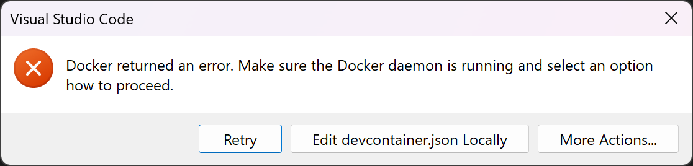

# Troubleshooting

## Linux

- If you are not using the dev container, and your distribution's `tftp` times out, install `busybox`, and try again.
If Busybox conflicts with your current tftp package, remove that and then install Busybox again.
Then, just running `tftp` should work.
This is an issue we are having with Fedora's tftp package, and possibly more.

## macOS

## Windows 11

- If you open ukoOS in the dev container, and you get this error:

```
/workspaces/ukoos # ./configure
env: ‘bash\r’: No such file or directory
env: use -[v]S to pass options in shebang lines
```

run `git reset --hard`.
**NOTE THIS WILL ERASE ALL YOUR LOCAL CHANGES**.

- If you get the error shown below, you will need to launch Docker Desktop, then try connecting to the dec container again.



- If Docker Desktop does not open, you need to open Task Manager and end the "Docker Desktop Backend" task, shown below.
(To end a task, click on it, then click "End task" on the top right.)


## Dev Container
