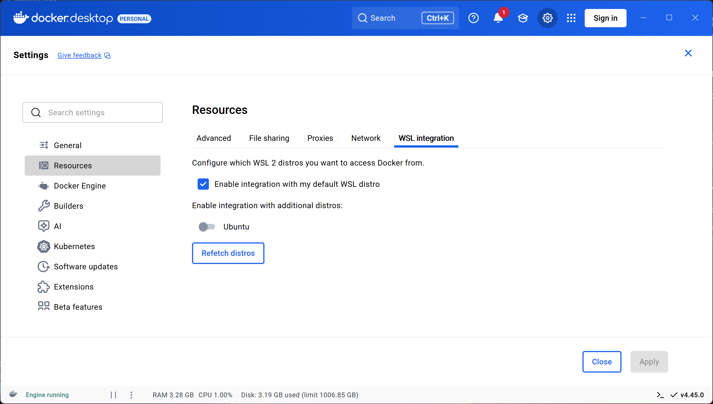
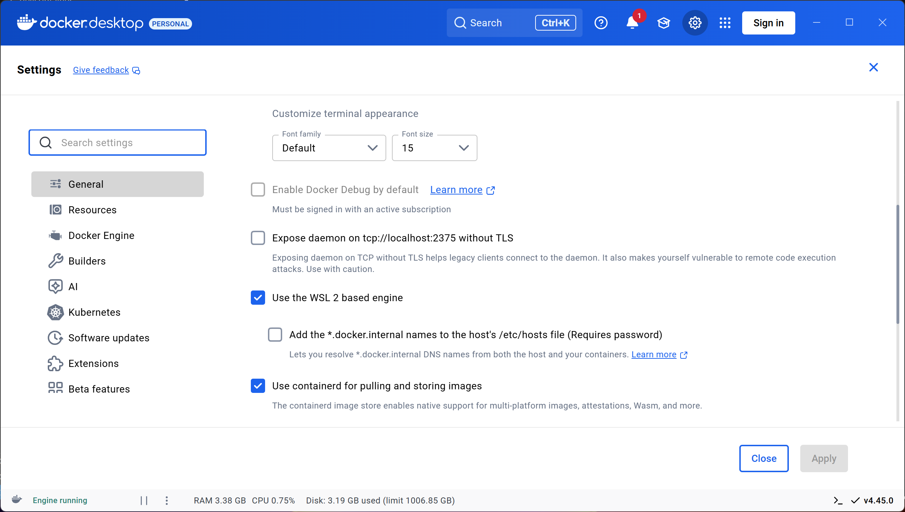

# Windows 11 Setup Guide

### Note that doing this on Windows 11 requires more setup, and is more prone to errors then macOS and Linux. If you can, we recommend using macOS or Linux

We need to first install everything needed for running our environment.

First, install WSL.
You need to verify Hardware Virtualization is enabled (note all pre-installed Windows 11 computers should come with Virtualization enabled).
Go to [this link](https://support.microsoft.com/en-us/windows/enable-virtualization-on-windows-c5578302-6e43-4b4b-a449-8ced115f58e1) to learn how to enable Hardware Virtualization.
Once that is enabled, open a `PowerShell` window and run the following command:

`wsl --install`

Install [git](https://git-scm.com/downloads) if you do not have it already.
You can install it using Winget (`winget install --id=Git.Git  -e`), or downloading from their [website](https://git-scm.com/downloads).

Install [Docker Desktop](https://docs.docker.com/desktop/setup/install/windows-install/).
Download it, run the installer and follow any installation prompts.

Open Docker Desktop and verify these settings (you can skip the account page if you'd like):

- Settings -> verify "Use the WSL 2 based engine" is checked.

- Settings -> Resources -> WSL integration -> verify "Enable integration with my default WSL distro" is enabled.

Download and install [Visual Studio Code](https://code.visualstudio.com/download).

Open Visual Studio Code, and navigate to the Extensions menu located at the bottom of the left hand side bar.
Install these extensions:

- [WSL](https://marketplace.visualstudio.com/items?itemName=ms-vscode-remote.remote-wsl)
- [Dev Containers](https://marketplace.visualstudio.com/items?itemName=ms-vscode-remote.remote-containers)

git clone ukoOS (`git clone https://github.com/UMN-Kernel-Object/ukoos`), open the folder in Visual Studio Code, and follow any installation prompts that pop up.
It should prompt you to `reopen in Dev Container`, If not, press `Ctrl` + `Shift` + `P` and type 'Reopen in Dev Container`.

You are now in the ukoOS Dev Container.
To verify this, run the below command and verify the line `NAME="Alpine Linux"` is present.
`cat /etc/os-release`
Before you make any local changes, you must run `git reset --hard`. **NOTE: IF YOU HAVE ANY LOCAL CHANGES, THIS COMMAND WILL DISCARD THEM.**
This allows you to run `./configure` without issues.

When you have a change ready to be commited, you must sign off your commits. Your commits should look something like this:
`git commit -s -m 'commit message'`
