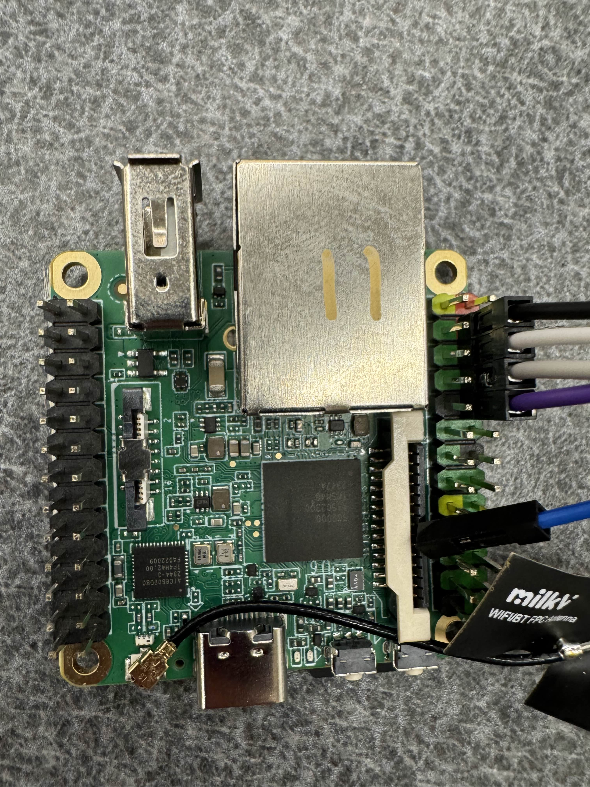
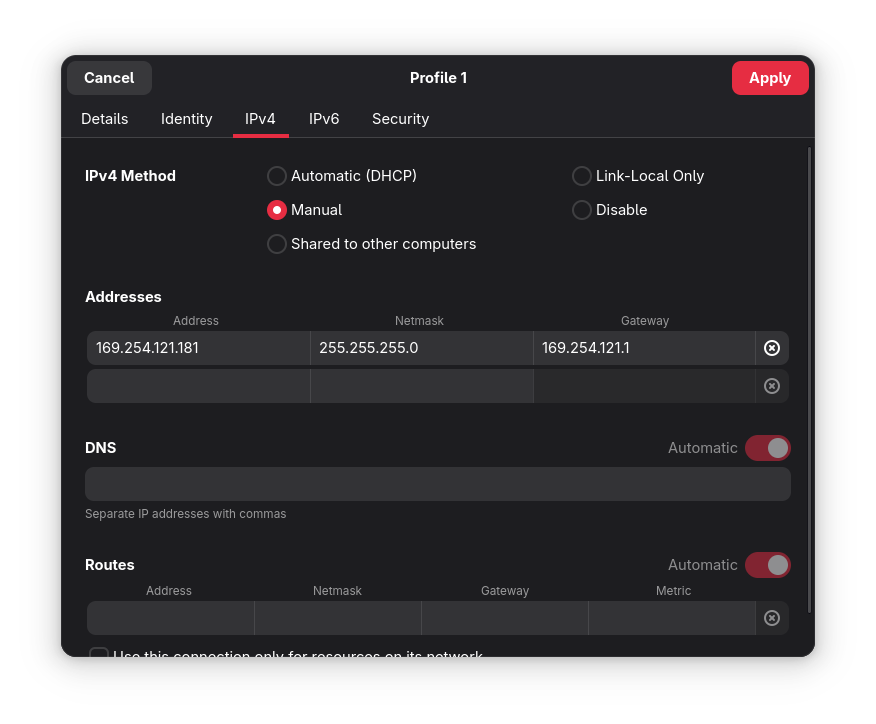

# Set Up

Connect to the board via an Ethernet cable.
Connect to the board via serial.
To do this, plug in the included USB UART adapter to your host system, and then plug in the UART cables to the board as described below.
If you do not plug in to the right pins, you run the risk of frying the board, so please follow these instructions carefully!

You will want to locate the pin on the UART board labeled `+5V`, above that will be `GND`, `RXD`, and `TXD` (shown below).
We will not be using the `3V3` pin (some of the boards have a cable coming out of `3V3`, ignore it).


The `+5V` cable will be attached to the second to top pin on the right side of the board, on the column of pins on the outward side, as shown below (black cable).
The `GND`, `RXD`, and `TXD` will then be plugged into the board below the `+5V`, in order of how they are listed on the UART board, as shown below.
NOTE - Your cable colors may be different.



Once you have these connected, you will need to connect to the board over serial.
We will describe how to connect to this via the dev container below.

## Accessing the board via serial through the dev container (We are assuming you are using Linux)

Before entering the dev container, you must add yourself to the correct group in order to pass the USB device through to the container.

Most distributions use the `dialout` group.
This includes Ubuntu, NixOS, and Debian.
You can check what your distro uses with `ls -g /dev/ttyUSB0`.
This will print something like `crw-rw---- 1 dialout 188, 0 Oct 30 21:35 /dev/ttyUSB0`.
If another word is there instead of `dialout`, that is the group you should use for the rest of the instructions.
If the group is `root`, ask an officer -- you probably need to do something different.

Run the following command outside of the dev container:

```
sudo usermod -aG dialout ${USER}
```

Note, you may need to log out and log back in for this to take full effect.

Then, via the dev container, run the following command (this should be your serial device, unless you have another serial device already connected):

```
sudo minicom -D /dev/ttyUSB0
```

Note, to exit the board, press `Ctrl + A`, then enter `q`, then press `Enter`.

The board should boot into U-Boot, and start its TFTP server by default.

Now, connect an Ethernet cable from the board to your laptop.
Reboot the board if the board is stuck or already booted in to a kernel.
If the board did boot into a kernel, spam the down arrow on your laptop in the serial console while the board is rebooting and select the network boot option in the menu once it appears.
Wait for the board to give up on connecting via BOOTP and take note of the link-local address it prints.

To send files to the board over TFTP, you first need to assign your host device an IP address (if you are on macOS or Windows, no extra work should be required for this to work, you should already have a working link-local connection).
If you are on Linux, follow the below steps:

Open your network settings, go into the Ethernet connection, and create a new connection, as shown below.



Make sure to set the mode of the network interface to `Link-Local`.

You can now send the kernel over TFTP with the following command:

```
busybox tftp -p -l <path to built kernel.elf> <board's link-local IP>
```

## Troubleshooting

- Verify that you HAVE 5v connected and do NOT have 3.3v connected
- 5v pin cable lines up with second red, the rest of the pin cables connect going down, in order
- Button closest to edge reboots the board
- Verify your Ethernet cable is fully functional
- Make sure the dev container is up to date
